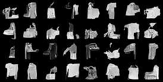

All models are trained for ~20 epochs with learning rates from $10^{-3}$ to $10^{-4}$. Most runs used a scheduler that halves the learning rates after three epochs without loss improvement.

Minibatch size: 64

## Very basic model

The noise level/time step is not used at all.

The loss curve maybe shows some suboptimal initialization.

## Conditioning on timestep/noise level

The BatchNorms use affine parameters learned from the noise embedding through a linear layer.

## Spatial Encoding

We add cartesian X/Y and polar coordinates to the model input, which maybe improves coherence of the generated images.

## Add class embeddings to generate specific classes

A 4-dimensional class embedding is trained and concatenated with the input image.

## Generation process visualized

# Unet

Class conditioning only concatenated to input once: only generates two classes regardless of what is asked for.

Adding it as an input to the conditional batchnorm improves things.

Good bugs:

 - tensors are CoW, so you need to copy them to keep residuals
 - Pooling as first step in a Unet block did not work, as you're throwing away a lot of information before any convolutios

I don't know what was happening here, but some Unet setups worked okay for the first few epochs, but then only ever produced the same blob regardless of sampling or class label:

Epoch 5:

Epoch 10:

Epoch 15:

Epoch 20:

Epoch 25 and after:
