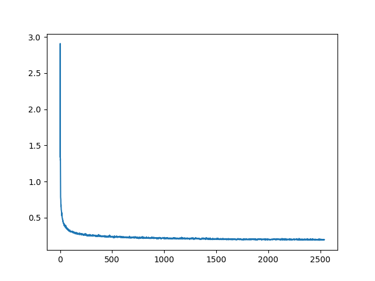
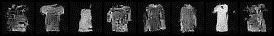
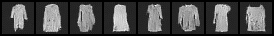

# Resnet FashionMNIST

All models are trained for ~20 epochs with learning rates from $10^{-3}$ to $10^{-4}$. Most runs used a scheduler that halves the learning rates after three epochs without loss improvement.

Minibatch size: 64

## Very basic model

The noise level/time step is not used at all.

Loss curve:

## Conditioning on timestep/noise level

The BatchNorms now use affine parameters learned from the noise embedding through a linear layer.

## Spatial Encoding

We add cartesian X/Y and polar coordinates to the model input, which maybe could improve coherence of the generated images.

It does not.

## Add class embeddings to generate specific classes

A 4-dimensional class embedding is trained and concatenated with the input image.

## Generation process visualized

# Unet

## FashionMNIST

Class conditioning only concatenated to input once: only generates two classes regardless of what is asked for.

Adding it as an input to the conditional batchnorm improves things.

Bugs along the way:
 - tensors are CoW, so you need to copy them to keep residuals
 - Pooling as first step in a Unet block did not work, as you're throwing away a lot of information before any convolutios

I don't know what was happening here, but some Unet setups worked okay for the first few epochs, but then only ever produced the same blob regardless of sampling or class label:

Epoch 5:

Epoch 10:

Epoch 15:

Epoch 20:

Epoch 25 and after:

First, I basically tried random variations of resibual block structures, skip connections, number of channels etc.

Sometimes, images would turn out very good, but only ever generate one class, regardless of input.

What worked in the end was changing how the class conditioning was integrated into the model.
Instead of the conditional BatchNorm (the only place where the class actually intervened),
every residual block trains its own class embedding layer, whose output gets added to the feature map inbetween two convolutions.
The previously conditional BatchNorm was replaced with a GroupNorm, though I don't think that was key here.

Final model size: 10M parameters.

## CelebA

45M parameter model. GroupNorm and timestep embedding. Trained for ~4 epochs, 90 minutes.

# FashionMNIST FID scores

| Model | FID score|
|-|-|
| Simple ResNet, no noise/class conditioning | 161 |
| ResNet, with noise conditioning |  102 |
| ResNet, with class+noise conditioning | 68 |
| UNet | 115 |